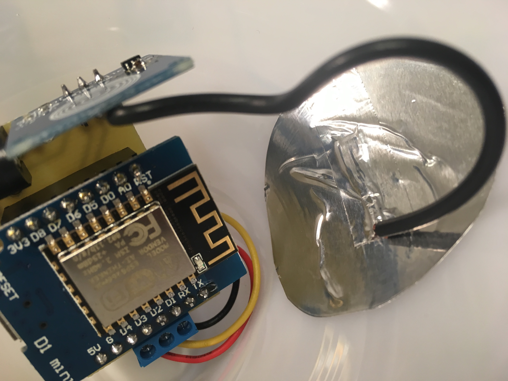

# Let's make: WiFi Lamp

ESP8266 chip on Wemos D1 mini module that is driving WS2812 LED strip, one tactile switch or touch sensor for manual control.
Firmware contains React web app for controlling the lamp via HTTP REST API.

More resources:
* [3D prints](stl)
* [Firmware](firmware/lm-wifilamp) - uses [Arduino core for ESP8266](https://github.com/esp8266/Arduino), no other libraries needed
* [Web](web) - written in [Preact.js](https://preactjs.com) (light React.js compatible framework)
* [Photos](pictures)
* [PCB](board) - simple PCB to avoid messing with lots of wires. Created in EAGLE 7.7

## How it looks

