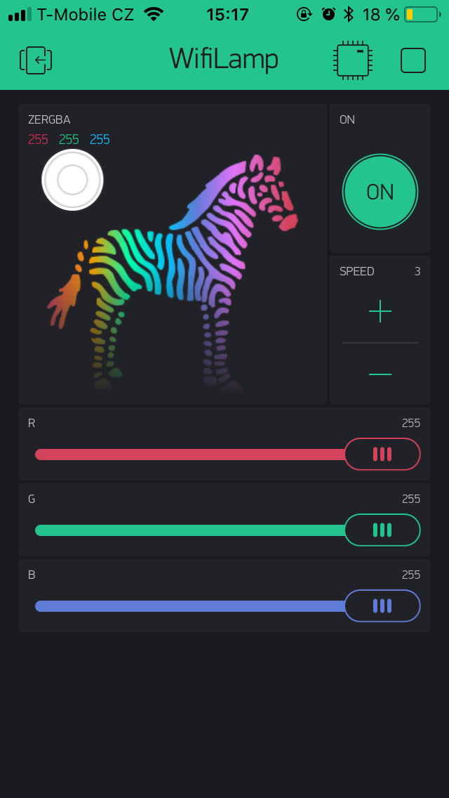
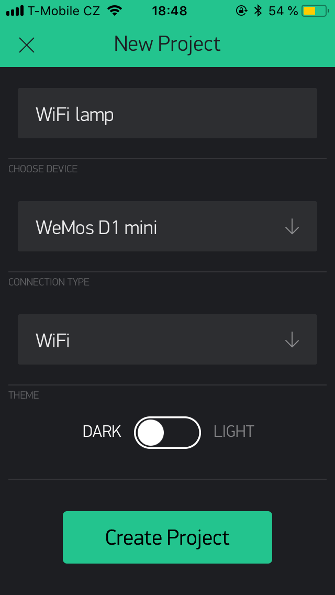

# Let's make: WiFi Lamp

ESP8266 chip on Wemos D1 mini module that is driving WS2812 LED strip, one tactile switch for manual control.
Firmware contains HTTP REST API and Blynk platform integration for mobile app control.

More resources:
* [3D prints](stl)
* Firmware
  * [Original](firmware/lm-wifilamp) - uses [Arduino core for ESP8266](https://github.com/esp8266/Arduino), using [Blynk](https://blynk.cc) platform
  * [Tester](firmware/lm-wifilamp-test) - testing sketch
* [Hardware assembly](pictures)
* [PCB drawings](board) - simple PCB to avoid messing with lots of wires. Created in EAGLE 7.7

## Setup

### On your computer

* Install [Arduino core for ESP8266](https://github.com/esp8266/Arduino#installing-with-boards-manager)
* Install the [Blynk Arduino library](http://help.blynk.cc/getting-started-library-auth-token-code-examples/how-to-install-blynk-library-for-arduino)
* Install the [WiFi Manager library](https://github.com/tzapu/WiFiManager)
* Compile and upload the [firmware](firmware/lm-wifilamp)

### On your mobile phone

* Install [Blynk app](https://www.blynk.cc/getting-started/)
* Create account or log in
* Create new empty project in Blynk App
* Copy auth token from the app or your email
* Connect to the wifilamp AP
* Wait for WiFi login popup (or use browser and navigate to `http://192.168.4.1`)
* Enter WiFi credentials and auth token

### Reconfiguring or resetting lamp

* Hold button until the lamp lights up with violet color
* Connect to the wifilamp AP
* Wait for WiFi login popup (or use browser and navigate to `http://192.168.4.1`)
* Enter WiFi credentials and auth token

## Blynk project

## How it looks

