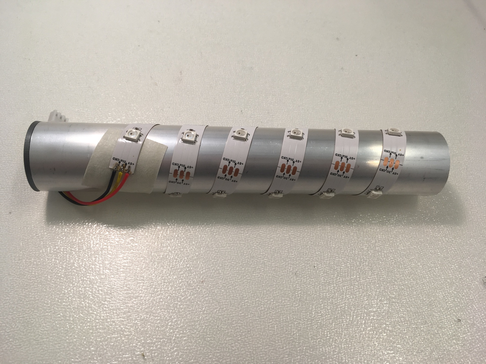
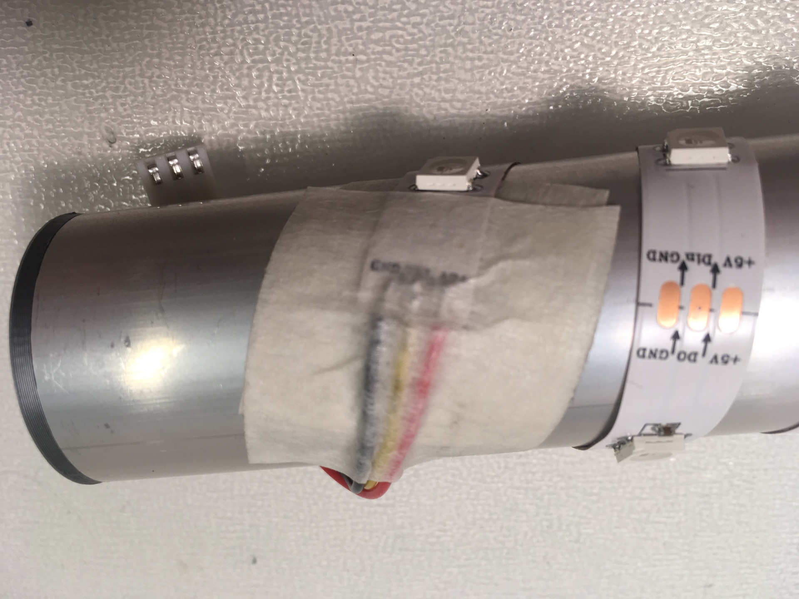

# Assembly instructions

## Button box

Slide longer cable assembly into the heat shrink tube. All the way up to the connector

Solder the wires sticking from the heat shrink tube to the PCB. Mind the correct colors!

Solder button and DC jack to the PCB. DC jack needs to lie flat and straight on the PCB. Same for the connector.

Move the heatshrink tube all the way to the PCB and shrink it using heat (regular lighter is OK). Place the PCB into the bottom part of the box. It needs to fit precisely into the printed slot in the box.

Place the knob on the switch and cover the box with top part. Button needs to click freely and loudly after the box is closed.

## LED holder

Solder the wires of the shorter cable assembly onto the LED strip. Mind the correct colors!

Stick one piece of paper tape on the top of the aluminium tube.

Stick the LED strip on the tube. Do not stick it all the way to the end for now! Strip must start on the paper tape!

Stick one piece of paper tape on the place where LED strip will end.

Finish the LED strip - end of the LED strip must be on the paper tape!

Secure start of the strip with piece of paper tape.

Secure end of the strip with piece of paper tape.

## Base

Put pin headers into the PCB. Short part of the pin header must face up, long part is in the PCB. Do not solder anything yet!

Place Wemos D1 mini on the short part of the pin headers and solder pin headers to Wemos D1 mini.

Pull Wemos D1 mini from the PCB and put at aside for a while.

Solder angle JST connector to the PCB (opening marked PWR). Connector must face out of the PCB

Solder straight JST connector to the PCB (opening marked LEDS). Mind the correct orientation (connector must line perfectly with the outline on the PCB).

Put pin header sockets on Wemos D1 mini

Solder Wemos D1 mini with sockets to the PCB. Wemos antenna (gold wiggly line) must match with the drawing on the PCB.

Pull Wemos D1 mini out of the socket.

Put M4 nut into the 3D printed circular holder.

Put M4 screw into the PCB.

Screw the 3D printed holder. Do not overtighten.

Slide the tube with LED strip onto the holder and connect the LEDS JST connector. Turn the holder and the tube slightly to straighten the cable.

Connect the box with button to the PWR JST connector.

Carefully unpack paper lamp body, turn the PCB assembly around and slide the paper body onto it.

Screw the M3 screws with the washer into the PCB. Do not overtighten, you can damage the PCB.

Note the position of the slots in the PCB (next to the screws).

Put one end of the spring into PCB slot and the other in the hook on the top of the lamp body.

## Finished

And you are done!

